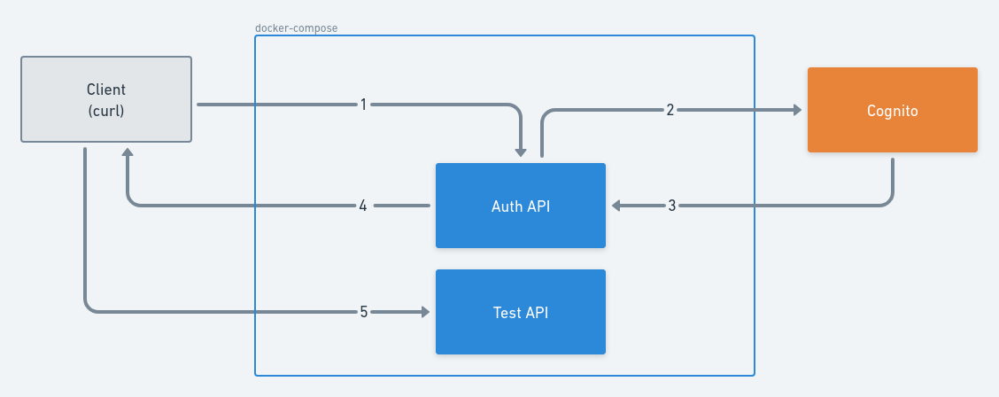

# Gonito
Cognito example in goland

  
  
  
  

## Auth API (AUDIENCE_1)
1. Create user in `Cognito`:
   - Public `POST` `localhost:8080/signup`, payload: {`username`, `password`, `audience`, `custom attributes`}.
2. Sign in to get a `JWT`:
   - Public `POST` `localhost:8080/signin`, payload: {`username`, `password`}.
3. Test `JWT` with `AUDIENCE_1`:
   - Private `GET` `localhost:8080/test Bearer <id_token>`

## Test API (AUDIENCE_2)
1. Test `JWT` with `AUDIENCE_2`:
   - Private `GET` `localhost:8081/test Bearer <id_token>`

## Requirements
- [go get -u github.com/go-chi/chi/v5](https://github.com/go-chi/chi)
- [go get github.com/aws/aws-sdk-go-v2/aws](https://github.com/aws/aws-sdk-go-v2#getting-started)
- [go get github.com/aws/aws-sdk-go-v2/config](https://github.com/aws/aws-sdk-go-v2#getting-started)
- [go get github.com/aws/aws-sdk-go/service/cognitoidentityprovider](https://docs.aws.amazon.com/sdk-for-go/api/service/cognitoidentityprovider/)
- [sops](https://github.com/mozilla/sops)

## Configuration

- Use `main.tf` to create user pool and two user pool clients.

- `sops --kms 'arn:aws:kms:XXXXXXXXXXXXXXXXXXXXXXXXXXXXXXXXXXXXX' secrets.enc.yaml `

      AWS_ACCESS_KEY_ID: ${AWS_ACCESS_KEY_ID}
      AWS_SECRET_ACCESS_KEY: ${AWS_SECRET_ACCESS_KEY}
      AWS_DEFAULT_REGION: ${AWS_DEFAULT_REGION}
      COGNITO_APP_CLIENT_ID: ${COGNITO_APP_CLIENT_ID}
      COGNITO_USER_POOL_ID: ${COGNITO_USER_POOL_ID}

- Set `AUD` local variable in `docker-compose`.

## Build and Run locally
`sops exec-env secrets.enc.yaml 'docker-compose up --build --remove-orphans'`

## Testing the Auth service

###  Private POST `/signup`
`curl localhost:8080/signup -d @./test/data/signup.json`

###  Public POST `/signin`
`curl localhost:8080/signin -d @./test/data/signin.json | jq`

### Private GET `/test`
`curl localhost:8080/signup -v -H "Authorization: Bearer <id_token>"`

## Testing the Test API

### Private GET `/test`
`curl localhost:8081/signup -v -H "Authorization: Bearer <id_token>"`
