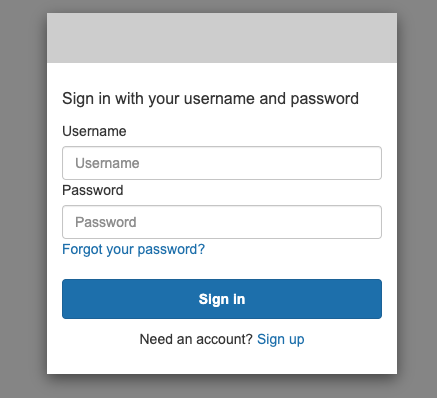
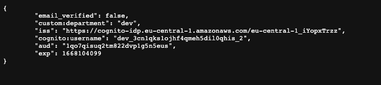
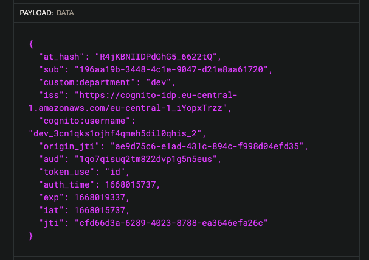

  
  
  
  

# Gonito

## Cognito oAuth2 Authorization Code Flow example in golang.

## OAuth 2.0 terminology
- Resource Owner: Entity that can grant access to a protected resource. Typically, this is the end-user.
- Client: Application requesting access to a protected resource on behalf of the Resource Owner.
- Resource Server: Server hosting the protected resources. This is the API you want to access.
- Authorization Server: Server that authenticates the Resource Owner and issues Access Tokens after getting proper authorization. In this case, Auth0.
- User Agent: Agent used by the Resource Owner to interact with the Client (for example, a browser or a native application).

## Authorization Code Flow

Because regular web apps are server-side apps where the source code is not publicly exposed, 
they can use the Authorization Code Flow (defined in [OAuth 2.0 RFC 6749, section 4.1](https://www.rfc-editor.org/rfc/rfc6749#section-4.1)), 
which exchanges an Authorization Code for a token. App must be server-side because during this exchange, 
we must also pass along our application's Client Secret, which must always be kept secure.

## Requirements
- [go get -u github.com/go-chi/chi/v5](https://github.com/go-chi/chi)
- [go get golang.org/x/oauth2](golang.org/x/oauth2)
- [go get -u github.com/coreos/go-oidc/v3/oidc]("github.com/coreos/go-oidc/v3/oidc")
- [sops](https://github.com/mozilla/sops)

## Configuration

- Use `main.tf` to create user pool and two user pool clients.

- `sops --kms 'arn:aws:kms:XXXXXXXXXXXXXXXXXXXXXXXXXXXXXXXXXXXXX' secrets.enc.yaml `

      COGNITO_APP_CLIENT_ID: ${COGNITO_APP_CLIENT_ID}
      COGNITO_OAUTH_CLIENT_SECRET: ${COGNITO_OAUTH_CLIENT_SECRET}

## Build and Run locally
`sops exec-env secrets.enc.yaml 'docker-compose up --build --remove-orphans'`

### Login endpoint
`http://localhost:8080/auth/login`

### Callback endpoint
`http://localhost:8080/auth/callback?code=xxxxxxxx-xxxx-xxxx-xxxx-xxxxxxxxxxxx&state=state`

