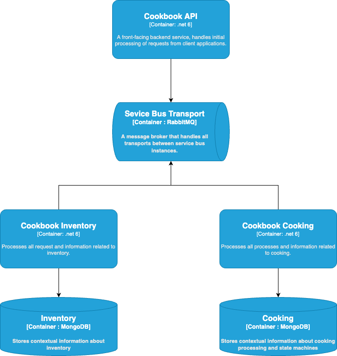
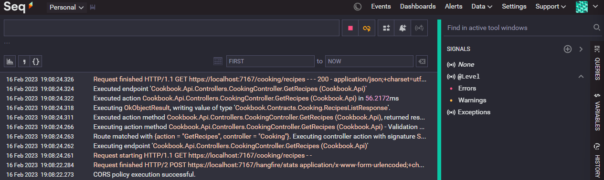
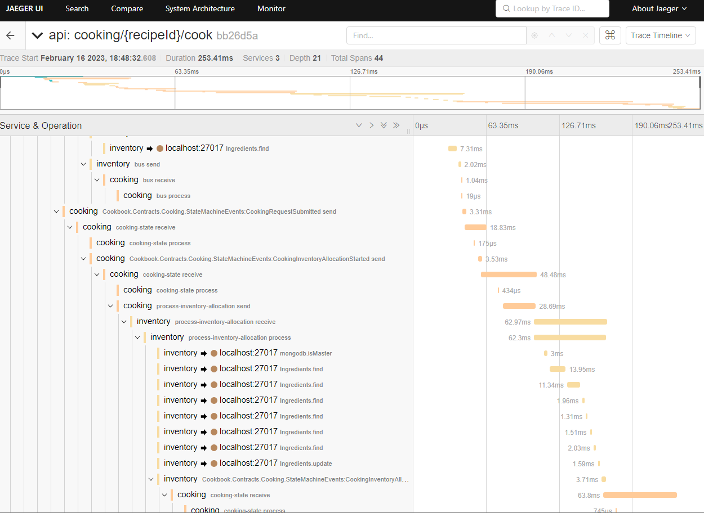
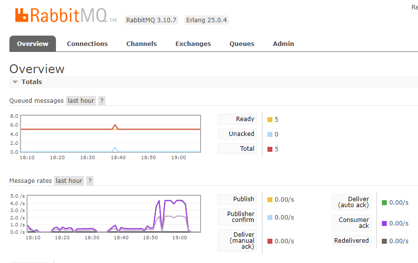
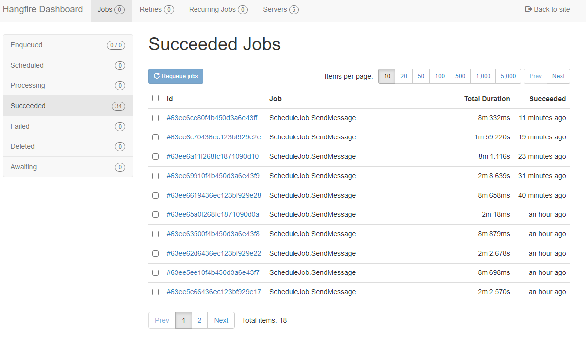
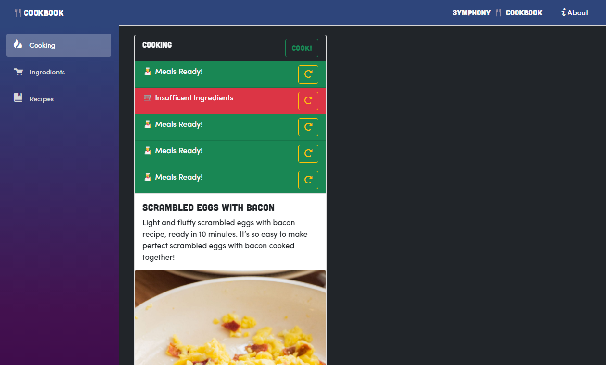
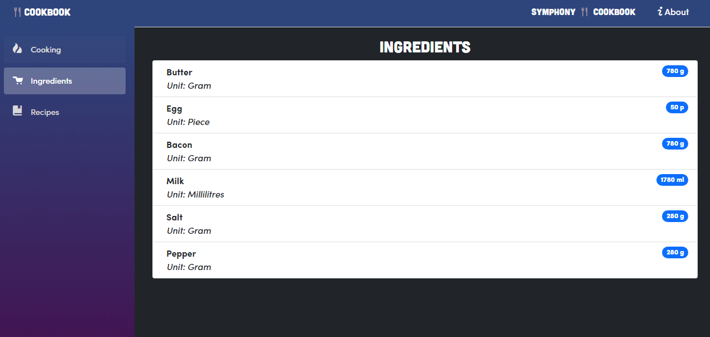
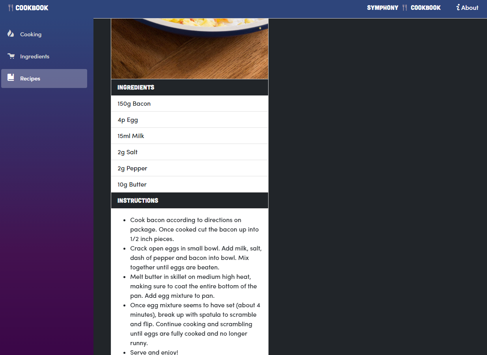

# Cookbook Services

Set of services written for food processing domain, focused on showcasing the implementation of an enterprise service bus.

## Tech stack:
- .Net 6
- MassTransit - service bus
- RabbitMQ - message broker
- Seq (with Serilog) - structured logging
- OpenTelemetry (with Jaeger) - telemetry monitoring
- Hangfire - delayed messaging


## System overview  
&nbsp;



System consists of three services, as shown in the image above:

 - Cookbook API - an API that starts all of the processes and allows for interaction with the system through OpenAPI (swagger) page
 - Cookbook Inventory - a service that processes all requests related to ingredients
 - Cookbook Cooking - a service that handles actual processing of ingredients and the cooking process through a distributed transaction using a state machine.

 There are two MongoDB databases, one for each of the backend services, Inventory and Cooking. Each of them stores infomration only related to a part of the process or relevant to their internal processes.

 ## Starting the system

---
Note:   
[Docker](https://www.docker.com/products/docker-desktop/) is mandatory for running this system's dependencies.  
[.Net 6](https://dotnet.microsoft.com/en-us/download) is mandatory for running the services.

---

  By running `docker-compose up` in the `cookbook-docker-services` directory, all of the required services will be setup in your local docker. **Be mindful of the ports as all ports in the system are default ones.**

  *Currently there's no docker image for each of the services, this is on TODO list.*

  After starting up docker containers, navigate to each of the services directories and do a `dotnet run` command, this will start each service individually. When docker deployment is handled this step will be made much easier :)

 ## Relevant URLs

Postman Collection can be found [here](./docs/Cookbook.postman_collection.json).

### Integrations:  
 Seq logging: http://localhost/#/events  
  

Jaeger telemetry: http://localhost:16686/search  
  

RabbitMQ management: http://localhost:15672/#/  
  

Scheduled and delayed messaging: http://localhost:7167/hangfire  


Services:

- API: 
  - OpenAPI - Swagger: https://localhost:7167/swagger
  - Health check - Ready: https://localhost:7167/health/ready
  - Health check - Live: https://localhost:7167/health/live
  - Scheduler - Hangfire: https://localhost:7167/hangfire
- Inventory:
  - Health check - Ready: https://localhost:7168/health/ready
  - Health check - Live: https://localhost:7168/health/live
  - Scheduler - Hangfire: https://localhost:7168/hangfire
- Cooking:
  - Health check - Ready: https://localhost:7169/health/ready
  - Health check - Live: https://localhost:7169/health/live
  - Scheduler - Hangfire: https://localhost:7169/hangfire


## Cookbook Frontend

Cookbook frontend is a blazor webassembly app that allows for interaction with the system through a web browser. It is a single page application that uses the API to communicate with the system. It is a work in progress and is not yet fully functional.






# Product

 - Introduction
    - Purpose of the document
    - Scope of the application
    - Overview of the features
 - User accounts
    - Description of the user accounts feature
    - User profiles and customization options
 - Materials collection
    - Description of the materials collection feature
    - Editing and adding materials
 - Recipe collection
    - Description of the recipe collection feature
    - Editing and adding recipes
    - Linking recipes to materials
 - Inventory system
    - Description of the inventory system
    - Storing and tracking materials
    - Displaying available materials
 - Recipe recommendations
    - Description of the recipe recommendation feature
    - Determining popular recipes
    - *Recommending recipes based on available materials*
 - User interface
    - *Description of the overall user interface design*
    - *Navigation and layout*
    - *Visual design elements*
 - *Technical considerations*
    - *Description of the technical architecture*
    - *Hardware and software requirements*
    - *Data storage and security*
 - Testing and deployment
    - *Description of the testing plan*
    - *Deployment process*
 - Maintenance and updates
    - *Description of the maintenance plan*
    - *Process for adding new features and updates*

## Introduction

### Purpose of the document

The purpose of this software design document (SDD) is to provide a detailed description of the Cook Book application, including its features, user interface, and technical considerations. The SDD will serve as a reference guide for the development team and stakeholders, and will outline the design decisions and requirements for the application. The SDD will also provide a roadmap for testing, deployment, and maintenance of the Cook Book application.

### Scope of the application

*The scope of the application refers to the boundaries and limits of the Cook Book application. It defines what the application will and will not do, and outlines the features and functionality that will be included.*

The Cook Book application is a digital platform that allows users to create and edit a collection of materials and recipes, and to track and manage their inventory of materials. Users can also access recipe recommendations based on the materials they have available. The application will include user accounts with configurable profiles, and will allow users to store and access their materials and recipes from any device. The Cook Book application will not include a shopping or delivery service for materials, and will not allow users to sell or trade materials or recipes.

### Overview of the features

*The overview of the features section of the SDD should provide a high-level summary of the main functionality and features of the Cook Book application. It should give a general idea of how the application works and what it can do for users.*

The Cook Book application is a digital platform that allows users to create and manage a collection of materials and recipes. Users can create and edit their own materials and recipes, and can link recipes to the materials they require. The application also includes an inventory system that allows users to store and track the materials they have available. Based on the materials in their inventory, the Cook Book application will recommend recipes that users can make. The application also includes user accounts with configurable profiles, allowing users to customize their experience and access their materials and recipes from any device. The Cook Book application will also feature a recommendation system that suggests popular recipes to users.

## User accounts

### Description of the user accounts feature

The Cook Book application includes a user accounts feature that allows users to create and manage their own profiles. Users can create an account by providing their email address and creating a password. Once they have created an account, they can access their profile and customize their settings. Users can edit their profile information, including their name, email address, and profile picture. They can also customize their notification settings and privacy preferences. The user accounts feature also allows users to access their materials and recipes from any device by logging into their account. Users can also reset their password if they have forgotten it.

### User profiles and customization options

The Cook Book application allows users to customize their profiles to personalize their experience. Users can edit their profile information, including their name, email address, and profile picture. They can also customize their notification settings, choosing which types of notifications they would like to receive and how they would like to receive them (e.g. email, push notification). Users can also adjust their privacy settings, choosing which aspects of their profile and materials and recipes collection are visible to other users. In addition to these customization options, the Cook Book application may also offer additional customization options in the future, such as the ability to change the theme or layout of the user interface.

## Materials collection

### Description of the materials collection feature

The Cook Book application allows users to create and manage their own collection of materials. Users can add new materials to their collection by providing the material name and any relevant information (e.g. type, quantity). They can also edit or delete materials from their collection as needed. The materials collection feature includes a search function that allows users to easily find specific materials in their collection. Users can also organize their materials into categories or tags to help them find and manage their materials more easily. In addition to managing their own materials collection, users can also view and access the materials collections of other users who have chosen to share their collections publicly.

### Editing and adding materials

Users can edit or add materials to their collection by accessing the materials collection feature in the Cook Book application. To add a new material, users can click the "Add Material" button and enter the material name and any relevant information (e.g. type, quantity). Once they have entered the material information, they can click the "Save" button to add the material to their collection.
To edit an existing material, users can locate the material in their collection and click the "Edit" button. This will open a form that allows them to update the material information. Once they have made their updates, they can click the "Save" button to save the changes to their collection.
Users can also delete materials from their collection by clicking the "Delete" button next to the material they want to remove. A confirmation prompt will appear to ensure that the user intends to delete the material. Once the user confirms the deletion, the material will be removed from their collection.

## Recipe collection

### Description of the recipe collection feature

The Cook Book application includes a recipe collection feature that allows users to create and manage their own collection of recipes. Users can add new recipes to their collection by providing the recipe name and any relevant information (e.g. ingredients, instructions, serving size). They can also edit or delete recipes from their collection as needed. The recipe collection feature includes a search function that allows users to easily find specific recipes in their collection. Users can also organize their recipes into categories or tags to help them find and manage their recipes more easily. In addition to managing their own recipe collection, users can also view and access the recipe collections of other users who have chosen to share their collections publicly.

### Editing and adding recipes

Users can edit or add recipes to their collection by accessing the recipe collection feature in the Cook Book application. To add a new recipe, users can click the "Add Recipe" button and enter the recipe name and any relevant information (e.g. ingredients, instructions, serving size). They can also link the recipe to the materials required in their collection. Once they have entered the recipe information, they can click the "Save" button to add the recipe to their collection.
To edit an existing recipe, users can locate the recipe in their collection and click the "Edit" button. This will open a form that allows them to update the recipe information and link the recipe to different materials in their collection. Once they have made their updates, they can click the "Save" button to save the changes to their collection.
Users can also delete recipes from their collection by clicking the "Delete" button next to the recipe they want to remove. A confirmation prompt will appear to ensure that the user intends to delete the recipe. Once the user confirms the deletion, the recipe will be removed from their collection.

### Linking recipes to materials

The Cook Book application allows users to link their recipes to the materials required in their collection. When creating or editing a recipe, users can select the materials required from their materials collection and associate them with the recipe. This information is then used by the application to recommend recipes to users based on the materials they have available in their inventory, and to track the materials used in each recipe.
For example, if a user has a recipe for a chocolate cake that requires cocoa powder and eggs, they can select these materials from their materials collection and link them to the recipe. When the user views their inventory, the application will show them how many of each material they have available, and will recommend recipes that they can make based on the materials they have. The application will also track the materials used in each recipe, so users can see which materials are being used the most and plan their inventory accordingly.

## Inventory

### Description of the inventory feature

The Cook Book application includes an inventory system that allows users to store and track their materials. Users can add materials to their inventory by selecting them from their materials collection and specifying the quantity they have available. The inventory system will then track the quantity of each material and update it as users add or remove materials.
Users can view their inventory at any time by accessing the inventory feature in the application. The inventory will display the materials they have available, along with the quantity of each material. Users can also search their inventory to find specific materials, or use the sorting and filtering options to organize their inventory in different ways.
The inventory system also includes a notification system that alerts users when they are running low on certain materials. Users can customize their notification settings to specify which materials they want to receive notifications for, and how they would like to receive the notifications (e.g. email, push notification).
The inventory system is integrated with the recipe recommendation feature, allowing the application to recommend recipes to users based on the materials they have available in their inventory. It also allows users to track the materials used in each recipe and plan their inventory accordingly.

### Storing and tracking materials

To store and track materials in the Cook Book application, users can add them to their inventory by selecting the material from their materials collection and specifying the quantity they have available. This can be done by accessing the materials collection feature and clicking the "Add to Inventory" button next to the material. Users will be prompted to enter the quantity of the material they want to add to their inventory. Once they have entered the quantity, they can click the "Save" button to add the material to their inventory.
The application will track the quantity of each material in the user's inventory as it changes over time. When a user adds or removes materials from their inventory, the application will update the quantity of the material to reflect the change. Users can view their inventory at any time by accessing the inventory feature in the application. The inventory will display the materials they have available, along with the quantity of each material.
In addition to storing and tracking materials, the Cook Book application also allows users to set low stock alerts for certain materials. When the quantity of a material falls below the specified threshold, the application will send a notification to the user to alert them that they are running low on that material. 

### Displaying available materials

The inventory is designed to be user-friendly and intuitive, with clear labels and an organized layout. Materials are displayed in a list, with each material showing the material name, quantity, and any relevant information (e.g. type, category). Users can also use the search function to find specific materials in their inventory.
To make it easy for users to access and use their materials, the Cook Book application also includes a "Quick Add" function that allows users to quickly add materials to their inventory from any screen in the application. Users can simply enter the material name and quantity, and the material will be added to their inventory automatically. This makes it easy for users to keep track of their materials as they use them, and ensures that their inventory is always up-to-date."
This description provides an overview of the process for displaying available materials in the Cook Book application, including how users can view and access their inventory, and how the application is designed to be user-friendly and intuitive. It also mentions the "Quick Add" function, which allows users to quickly add materials to their inventory from any screen in the application.

### Setting low stock alerts

The Cook Book application allows users to set low stock alerts for certain materials. When the quantity of a material falls below the specified threshold, the application will send a notification to the user to alert them that they are running low on that material. Users can set low stock alerts by accessing the inventory feature in the application and clicking the "Edit" button next to the material they want to set an alert for. This will open a form that allows them to set the threshold for the material. Once they have entered the threshold, they can click the "Save" button to save the alert settings.

## Recipe recommendations

### Description of the recipe recommendation feature

The Cook Book application includes a recipe recommendation feature that uses algorithms to recommend recipes to users based on the materials they have available in their inventory. The recommendation algorithms take into account the materials that users have linked to their recipes, as well as the materials available in their inventory, to generate a list of recommended recipes.
The recommendation algorithms use machine learning techniques to analyze data about users' materials and recipes, and to predict which recipes are most likely to be of interest to each user. The algorithms take into account various factors, such as the popularity of the recipes, the materials used in the recipes, and the user's past recipe selections. They also consider the user's personalization settings, such as their preferred cuisine and dietary restrictions.
The recommendation algorithms are designed to be dynamic and adaptive, continually learning and adapting as users add or remove materials from their inventory, or as they select or deselect specific recipes. This ensures that the recommendations are always relevant and personalized to each user.
Users can view their recommended recipes by accessing the recommendation feature in the application. The recommendations will be displayed in a list, with each recommendation showing the recipe name and any relevant information (e.g. ingredients, serving size). Users can click on a recommendation to view the full recipe, including the instructions and any additional information (e.g. nutrition facts).
The recommendation feature also includes a "Save" button that allows users to save the recommended recipes to their recipe collection for later reference. This makes it easy for users to keep track of the recipes they are interested in and to access them quickly and easily.
Users can customize their recommendation settings to specify their preferred cuisine and dietary restrictions, as well as any other preferences or constraints they may have. The recommendation algorithms will take these settings into account when generating recommendations, ensuring that the recommendations are tailored to each user's preferences and needs.
In addition to recommending recipes based on the materials available in the user's inventory, the recommendation feature also includes a "Popular Recipes" section that displays the most popular recipes among all users of the application. This allows users to discover new recipes and to see what other users are enjoying.
Overall, the recipe recommendation feature in the Cook Book application is designed to help users find and discover new recipes that are tailored to their preferences and the materials they have available, and to make it easy for them to save and access the recipes they are interested in.

### Determining popular recipes

The recommendation algorithms in the Cook Book application use a variety of techniques to determine the popularity of the recipes. One approach is to analyze data about users' interactions with the recipes, such as how often they are viewed, saved, or shared. The algorithms can use this information to calculate a popularity score for each recipe, which reflects its overall popularity among all users of the application.
Another approach is to consider the popularity of the recipes among users with similar preferences or constraints. For example, the algorithms might compare the popularity of a recipe among users who have specified a preference for Italian cuisine to the popularity of the recipe among users who have specified a preference for Mexican cuisine. This allows the algorithms to personalize the recommendations to each user and to recommend popular recipes that are more likely to be of interest to the user.
The recommendation algorithms also take into account other factors that might affect the popularity of a recipe, such as the ingredients used in the recipe, the difficulty level, and the overall quality of the recipe. They use this information to generate a list of popular recipes that are relevant and of high quality.
Overall, the recommendation algorithms in the Cook Book application use a combination of data analysis and decision-making techniques to determine the popularity of the recipes and to recommend the most popular recipes to users.
The "Popular Recipes" section of the recipe recommendation feature displays the most popular recipes among all users of the application. These recommendations are generated by the recommendation algorithms and are updated on a regular basis to reflect the most current popularity scores.
Users can view the "Popular Recipes" section by accessing the recommendation feature in the application. The popular recipes will be displayed in a list, with each recommendation showing the recipe name and any relevant information (e.g. ingredients, serving size). Users can click on a recommendation to view the full recipe, including the instructions and any additional information (e.g. nutrition facts).
The "Popular Recipes" section is designed to help users discover new recipes and to see what other users are enjoying. It is a valuable resource for users who are looking for inspiration or who want to try new recipes that are popular among their peers.
Overall, the recipe recommendation feature in the Cook Book application is designed to help users find and discover new recipes that are tailored to their preferences and the materials they have available, and to make it easy for them to save and access the recipes they are interested in. The recommendation algorithms use data analysis and decision-making techniques to determine the popularity of the recipes and to recommend the most popular recipes to users. The "Popular Recipes" section is a valuable resource for users who are looking for inspiration or who want to try new recipes that are popular among their peers. The feature is designed to be dynamic and adaptive, continually learning and adapting as users add or remove materials from their inventory, or as they select or deselect specific recipes, to ensure that the recommendations are always relevant and personalized to each user.

## User interface

When designing the user interface (UI) for a cookbook application, it's important to consider the needs of the users and the main tasks they will be performing with the app. Some key points to consider when designing the UI for a cookbook app might include:
 - Easy navigation: The UI should be easy for users to navigate and find what they're looking for, whether it's a specific recipe or a particular type of cuisine.
 - Clear organization: The UI should clearly organize recipes and other content so that users can easily find what they're looking for. This could include using categories, tags, and other types of filters to help users narrow down their search.
 - Responsive design: The UI should be designed to work well on a variety of devices, including smartphones, tablets, and desktop computers.
 - High-quality images: Since a cookbook app is likely to include a lot of images of food, it's important to ensure that the images are high quality and visually appealing.
 - Recipe details: The UI should include all the necessary details for each recipe, including ingredients, instructions, and any relevant notes or tips.
Overall, the goal of the UI design for a cookbook app should be to create a user-friendly and visually appealing experience that helps users find and use the recipes they're looking for.

## Testing plan

A testing plan is an important part of the development process for any software application, including a cookbook app. A testing plan outlines the specific tests that will be performed to ensure that the application is functioning correctly and meets the requirements and expectations of the users.
Some key elements that might be included in a testing plan for a cookbook app could include:
 - Types of tests: This could include unit tests, integration tests, and acceptance tests, as well as any other types of tests that are relevant to the application.
 - Test coverage: This could include a list of all the features and functionality that will be tested, as well as any edge cases or scenarios that need to be considered.
 - Test environment: This could include information about the hardware and software that will be used to perform the tests, such as the operating systems and devices that will be used.
 - Test data: This could include any sample data that will be used to test the application, such as recipes and materials.
 - Test schedule: This could include a timeline for when each type of test will be performed, as well as any dependencies between different tests.

 ## Maintenance plan

 A maintenance plan is a document that outlines the ongoing tasks and activities required to keep a software application running smoothly and effectively over time. For a cookbook app, a maintenance plan might include tasks such as:
Updating the database with new recipes and materials: As new recipes and materials are added to the app, they will need to be added to the database to ensure that users can access them.
 - Fixing bugs: As users interact with the app, they may encounter bugs or other issues that need to be addressed. The maintenance plan should include processes for identifying and fixing these issues.
 - Adding new features: Users may request new features or functionality for the app, and the maintenance plan should include a process for evaluating and implementing these requests.
 - Monitoring performance: The maintenance plan should include regular checks on the performance of the app to ensure that it is running smoothly and efficiently.
 - Backing up data: To ensure the integrity of the data in the app, it is important to regularly back up the database and other data stores.

# Testing data sets

## Ingredients

```json
{
   "name": "Butter",
   "quantity": 1000,
   "unit": "Gram"
},
{
   "name": "Egg",
   "quantity": 100,
   "unit": "Piece"
},
{
   "name": "Bacon",
   "quantity": 1000,
   "unit": "Gram"
},
{
   "name": "Milk",
   "quantity": 2000,
   "unit": "Millilitres"
},
{
   "name": "Salt",
   "quantity": 500,
   "unit": "Gram"
},
{
   "name": "Pepper",
   "quantity": 500,
   "unit": "Gram"
}
```
## Recipes

```jsonc
{
  "name": "Scrambled Eggs With Bacon",
  "description": "Light and fluffy scrambled eggs with bacon recipe, ready in 10 minutes. It’s so easy to make perfect scrambled eggs with bacon cooked together!",
  "instructions": "-   Cook bacon according to directions on package. Once cooked cut the bacon up into 1/2 inch pieces. -   Crack open eggs in small bowl. Add milk, salt, dash of pepper and bacon into bowl. Mix together until eggs are beaten. -   Melt butter in skillet on medium high heat, making sure to coat the entire bottom of the pan. Add egg mixture to pan. -   Once egg mixture seems to have set (about 4 minutes), break up with spatula to scramble and flip. Continue cooking and scrambling until eggs are fully cooked and no longer runny. Serve and enjoy!",
  "imageUrl": "https://brooklynfarmgirl.com/wp-content/uploads/2014/09/Scrambled-Eggs-With-Bacon_7-1365x2048.jpg",
  "prepTime": 2,
  "cookTime": 8,
  "servings": 2,
  "ingredients": [
    {
      "ingredientId": "", // bacon id
      "quantity": 150
    },
    {
      "ingredientId": "", // egg id
      "quantity": 4
    },
    {
      "ingredientId": "", // milk id
      "quantity": 15
    },
    {
      "ingredientId": "", // salt id
      "quantity": 2
    },
    {
      "ingredientId": "", // pepper id
      "quantity": 2
    },
    {
      "ingredientId": "", // butter id
      "quantity": 10
    }
  ]
}
```

## Continuation of implementation ideas

"Real-time Inventory Tracking System" for a small retail store or a restaurant.

Business Problem:
 - In a small business like a retail store or a restaurant, managing inventory can be a constant challenge. It's important to know when items are running low and need to be restocked, and it can be difficult to keep track of this in real time, especially during busy periods.
 
Solution Overview:
 - The Real-time Inventory Tracking System uses the real-time image processing system to analyze video feeds from cameras pointed at key areas, such as the store shelves or a restaurant's food storage area. As the video plays, it's divided into individual frames, which are then analyzed for the number and type of items present.

Major Components:
 - Video Capture: This module interfaces with the store's camera system to obtain a real-time video feed of the inventory area.
 - Frame Extraction: As the video feed is processed, it is divided into individual frames, which are then fed into the event queue. Each new frame is an event that triggers the image processing operations.
 - Item Detection and Counting: This module uses image processing techniques to identify and count items in the frame. Initially, this could be as simple as counting the number of visible items on a shelf or in a storage area.
 - Inventory Update: This module updates the inventory based on the item count from the previous step and flags items that are running low.
 - Results Display / Reporting: The results of the inventory analysis are displayed to the user in real time, and are also aggregated into reports for later analysis.

AI Integration:

As the system evolves, AI techniques could be introduced to enhance its capabilities:
 - Object Recognition: AI could be used to identify specific items in the frame, allowing for more detailed inventory tracking.
 - Predictive Analysis: Based on the rate at which items are depleted, AI could be used to predict when each item will run out, helping to optimize restocking schedules.

This project is a smaller scale and more feasible for a small business, but it still involves event-driven programming and CPU-intensive operations, and it also has a clear business use case. Furthermore, the addition of AI features provides a path for future development and enhancement.